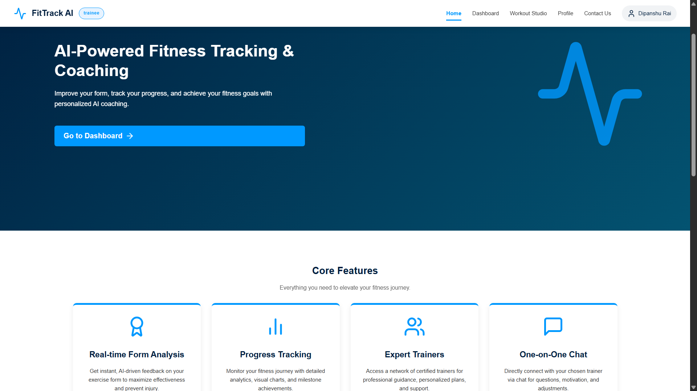
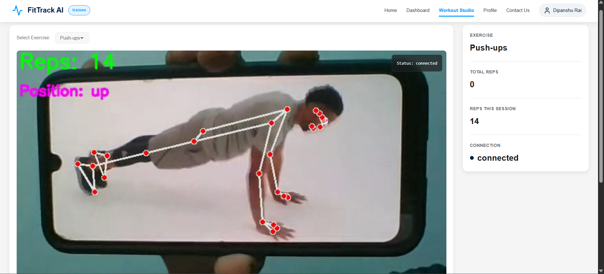
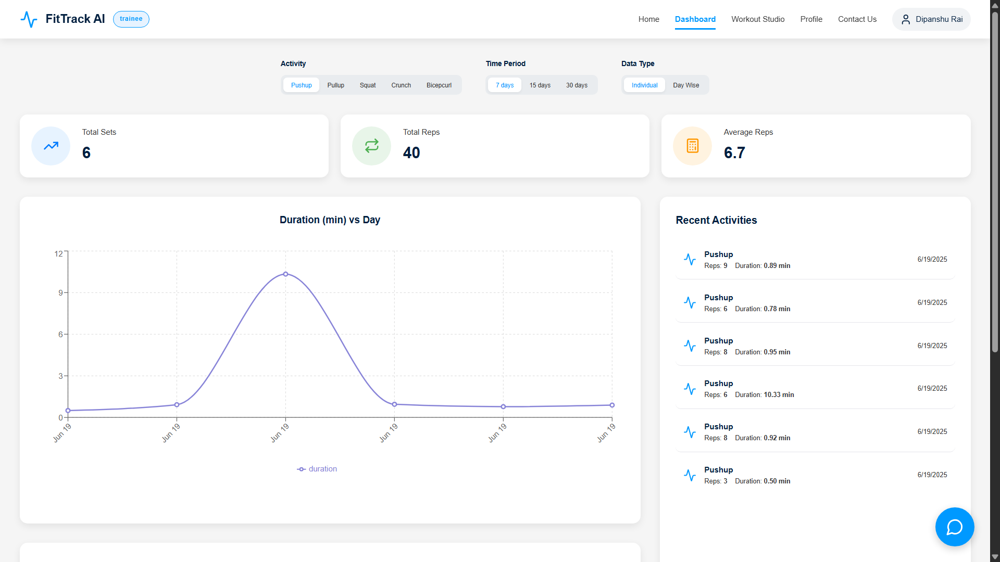
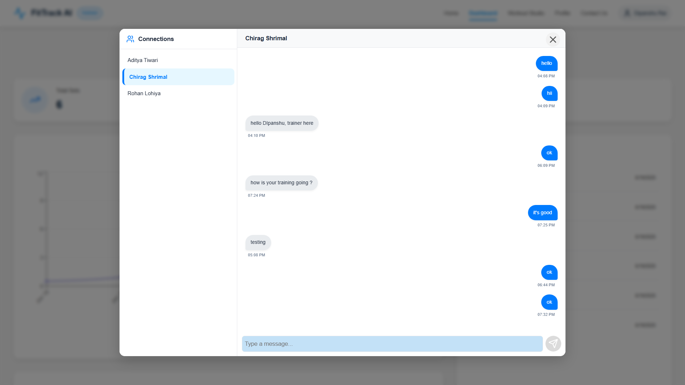
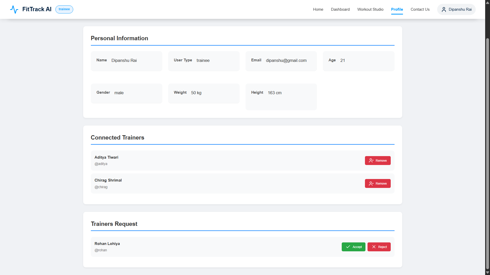

# FitTrack AI 💪🤖

**FitTrack AI** is a modern, full-stack web application designed to revolutionize personal fitness. It leverages real-time AI and computer vision to provide users with instant feedback on their exercise form, tracks their progress, and connects them with professional trainers for a personalized coaching experience.

---

## 🚀 Key Features

-   **Real-time AI Form Analysis**: Utilizes your device's camera to analyze exercise form in real-time, offering instant feedback on posture and movement to maximize effectiveness and prevent injury.
-   **Interactive Dashboard & Progress Tracking**: A comprehensive dashboard visualizes your workout history, including total sets, reps, and workout duration over time with interactive graphs.
-   **Trainer-Trainee Connection Management**: A complete social system allowing trainees to connect with trainers, send/receive requests, and build their professional fitness network.
-   **Real-time One-on-One Chat**: A built-in, real-time messaging system for seamless communication between trainees and their connected trainers.
-   **Scalable AI Backend**: Built with a multi-process worker architecture to handle multiple concurrent user sessions for form analysis.
-   **Secure Authentication**: JWT-based authentication to ensure user data and sessions are secure.

---

## 📸 Screenshots

#### 🏠 Homepage



#### 🏋️ Workout Studio



#### 📊 Trainee Dashboard



#### 💬 Chat with Trainer



#### 👤 User Profile & Connections



---

## 🛠️ Tech Stack & Architecture

### System Architecture
The application uses a **Broker-Worker** model for its AI processing.
-   **Node.js Broker**: The main backend server acts as a broker. It manages a pool of available Python workers and handles all user authentication, data, and chat signaling.
-   **Python AI Workers**: Multiple Python processes run independently. Each worker connects to the broker, announces its availability, and processes one AI/WebRTC session at a time. This architecture allows the system to scale horizontally by simply running more worker processes.

### Technologies Used

| Frontend           | Backend (Broker)          | AI & ML (Workers)         |
| ------------------ | ------------------------- | ------------------------- |
| React.js           | Node.js                   | Python                    |
| React Router       | Express.js                | OpenCV                    |
| Axios              | MongoDB                   | MediaPipe                 |
| Socket.IO Client   | Mongoose                  | `aiortc` (for WebRTC)     |
| CSS3               | JSON Web Tokens (JWT)     | `python-socketio`         |
|                    | Socket.IO                 | NumPy                     |

---

## 🏁 Getting Started

To get a local copy up and running, follow these simple steps.

### Prerequisites

-   Node.js & npm (v16 or later)
-   Python (v3.8 or later)
-   MongoDB (local instance or a cloud URI from MongoDB Atlas)

### Installation

1.  **Clone the repository:**
    ```sh
    git clone https://github.com/DipanshuRai/FitTrack-AI-2.0.git
    cd FitTrack-AI-2.0
    ```

2.  **Setup the Backend (Broker):**
    ```sh
    cd backend
    npm install
    ```
    Create a `.env` file in the `backend` directory and add the following variables:
    ```env
    PORT=5000
    MONGO_URI=your_mongodb_connection_string
    JWT_SECRET=your_super_secret_jwt_key
    CORS_ORIGIN=http://localhost:5173
    ```

3.  **Setup the AI Workers:**
    ```sh
    cd exercise-modules
    ```
    It is highly recommended to use a Python virtual environment:
    ```sh
    python -m venv venv
    source venv/bin/activate  # On Windows, use `venv\Scripts\activate`
    ```
    Install the required packages:
    ```sh
    pip install -r requirements.txt
    ```
    *Note: Create a `requirements.txt` file in the `ml-server` directory with the following content:*
    ```txt
    opencv-python
    mediapipe
    aiortc
    python-socketio[client]
    numpy
    ```

4.  **Setup the Frontend:**
    ```sh
    cd frontend
    npm install
    ```
    Create a `.env` file in the `frontend` directory and add the API URL:
    ```env
    VITE_API_URL=http://localhost:5000
    ```

---

## 🏃‍♀️ Running the Application

You need to start all three parts of the system in separate terminal windows.

1.  **Start the Backend Server:**
    ```sh
    # In the /backend directory
    npm start
    ```

2.  **Start the AI Workers:**
    For each worker you want to run (1 worker per CPU core is recommended), open a new terminal:
    ```sh
    # In the /exercise-modules directory (with virtual environment activated)
    python mlModel.py
    ```
    *You can run this command in multiple terminals to start multiple workers.*

3.  **Start the Frontend Development Server:**
    ```sh
    # In the /frontend directory
    npm run dev
    ```

---